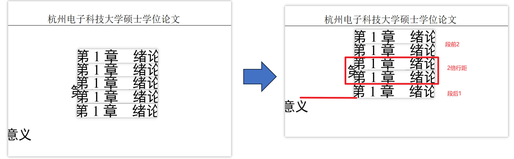
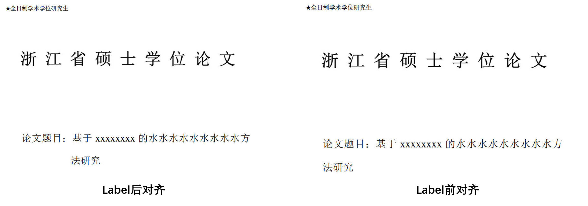

# 杭州电子科技大学硕士毕业论文 LaTeX 模版


本模版用于撰写杭州电子科技大学硕士毕业论文，基于 XeLaTeX 编译，提供盲审版和非盲审版两种样式供选择。

## Changelog

### 260315

- [x] 对齐正文行距，固定约20磅
- [x] 缩短小标题编号与内容间距
- [x] 缩短图表与正文间隔
- [x] 优化页边距（缩短加长，合并代码注意检查表宽是否会超）
- [x] 优化双面打印页边距
- [x] 希望今年不会再改了😅

### 260314

- [x] 调整宋体加粗后字重，使加粗更明显 [issues2](https://github.com/LinJ0866/hdu-master-thesis-template-latex/issues/2)

### 260312

- [x] 对齐目录页码，图表目录前置，页码编号继承
- [x] 对齐盲审封面：加粗所有字体（建议直接使用pdf替换更保险）

### 260302

- [x] 优化一级标题行距，符合“段前2行段后1行行间距2倍”格式要求



### 260227

- [x] 优化盲审编译部分因内容过长导致对齐不美观（支持对齐到label前与对齐到label后，自行启用注释修改）
  - [x] 盲审封面：`theme/hduthesis.cls L499起`
  - [x] 研究成果：`blind_review/blind_review_self.tex L101起`



- [x] 优化盲审研究成果页
  - [x] 将第一部分表格样式与内容分离，渲染时自动读取`blind_review/publications.csv`，提升写作体验
  - [x] 字号对齐新版附件（标准字号改为5号）
- [x] 盲审封面与成果页支持PDF替换，需分别存储至`blind_review/封面.pdf`和`blind_review/成果.pdf`
- [x] 修改github action，可同时编译出盲审与非盲审版本

### 260109

- [x] 优化中英文摘要缩进与悬挂样式

### 260107

- [x] 优化图名表名居中显示样式

### 260106

- [x] 对齐部分格式，如封面论文题目两行居中、去掉中/英文扉页冒号
- [x] 新增二导接口：增加对第二导师（Co-advisor）的配置接口，支持在封面与相关信息页中按需显示。当未设置二导信息时，模板将自动忽略对应字段，不影响整体排版与编译。
- [x] 增加格式保底逻辑，在编译阶段引入文件存在性判断逻辑：
  - 若 `contents/` 目录中存在 `封面.pdf`，则直接使用该 PDF 文件替换模板生成的封面内容；
  - 若 `contents/` 目录中存在 `论文原创声明和使用授权说明.pdf`，则直接使用该 PDF 文件替换模板生成的对应页面。

## 文件说明

- **main.tex**论文的主入口文件，通过 XeLaTeX 编译生成最终的 PDF 文件。
- **theme/hduthesis.cls**定义论文模版的文档类文件，其中包含所有格式设置与自定义命令。
- **theme/logo/HDUlogo.pdf**
  杭电校徽文件，在 README 顶部和论文封面中使用。

## 编译说明

- 本模版使用 **XeLaTeX** 进行编译，建议使用 TeX Live 或 MikTeX 最新版本。
- 编译入口为 **main.tex**。在终端下可使用以下命令进行编译：

  ```bash
  xelatex main.tex

  ```
- 编译过程中可能需要运行多次 XeLaTeX 命令以正确生成目录、参考文献等。
- 也可以选择使用GitHub Actions来进行编译，编译完成后会将pdf进行release，使用Actions时需要你为当前仓库添加一个 `名为GH_PAT`的Repository secrets，具体如何添加，作为一个研究生，你应该可以自己解决，去问GPT或者其他大语言模型吧。注意哈，私有仓库也是可以使用GitHub Actions的。

## 模版参数

在 **main.tex** 中，通过文档类选项来控制论文样式，例如：

```latex
\documentclass[oneside, nocpsupervisor, blind]{theme/hduthesis}
```

- **oneside**单面排版。如果需要双面排版，可调整为 `twoside`。
- **nocpsupervisor**不显示导师信息。根据实际需要，可以修改或去掉该选项。
- **blind**编译为盲审版（匿名评阅）。如需非盲审版，请将选项改为 `noblind`
- **academic表示学硕，professional表示专硕，不填这个参数默认为专硕**

## 格式保底

因为各种特性，部分页面（如封面等）难免难以对齐。在编译阶段引入文件存在性判断逻辑实现页面自动替换，进行格式保底。支持页面包括：

- `contents/封面.pdf`：替换封面 *【推荐！】*
- `contents/论文原创声明和使用授权说明.pdf`：替换论文原创声明和使用授权说明页 *【推荐！】*
- `blind_review/封面.pdf`：替换盲审封面 *【推荐！】*
- `blind_review/成果.pdf`：替换攻读硕士学位期间取得的研究成果页

## 注意事项

- 请确保系统已安装 XeLaTeX 编译环境，并正确配置字体。
- 如需修改模版样式，请参考 `theme/hduthesis.cls` 文件中的说明。
- 论文中引用的图片、图表等素材请放置在相应的文件夹中，并在主文件中正确引用。

---

希望这个 README 对你使用和修改模版有所帮助！
